# 🪐 ExoHabitat: A Learning Lab for Young Minds to Exoplanets and Habitability

## 🌌 Table of Contents

- [Collaborators](#collaborators)
- [Introduction](#introduction)
- [Features](#features)
- [Tech Stack](#tech-stack)
- [How It Works](#how-it-works)
- [Installation](#installation)
- [Screenshots](#screenshots)
- [Datasets and References](#datasets-and-references)
- [Contributing](#contributing)
- [License](#license)

## 👨‍💻 Collaborators

- [**Pratyay Koley**](https://github.com/PratyayKoley)
- [**Cyrus Gomes**](https://github.com/cyrus1811)
- [**Hardik Murudi**](https://github.com/hardikm79)
- [**Vedant Parte**](https://github.com/V4dant)

## 🪐 Introduction

ExoHabitat is a full-stack interactive web application that combines machine learning, astrophysics, and real-time 3D visualization to analyze and simulate the **habitability potential**, **exoplanet characteristics** of exoplanets. It leverages spectral analysis, atmospheric composition prediction, gravity simulations, and user-customizable planetary systems to create a rich exploration experience for scientists, students, and space enthusiasts.

🌐 **Live Site:** [exohabitat.vercel.app](https://exohabitat.vercel.app)

## ✨ Features

- 🧪 **Atmospheric Gas Detection (CO₂, H₂O, CH₄, O₂, N₂)** via machine learning on transit spectroscopy
- 🧠 **Habitability prediction** using Classical ML models
- ☢️ **Radiation Prediction** using Clustering ML models
- 📊 **Visualization of planetary data** like mass, temperature, radiation, density, orbital parameters
- 🛰️ **Compare planetary characteristics and habitability across multiple systems**
- 🪐 **User-generated solar system sandbox**: Create your own universe and test its life-sustaining potential
- 📈 **Gravity simulation**: Interactive Newtonian physics simulation for orbital mechanics

## ⚙️ Tech Stack

#### Frontend

- React + Vite
- Tailwind CSS
- Three.js (for 3D visualizations)

#### Backend

- Python + FastAPI + Google Colab
- Python (for ML models: clustering, decision trees)

  **Machine Learning**
- CNNs and MLPs for transit spectroscopy
- Clustering (KMeans)
- Decision Trees & Isolation Forests
- Random Forest Regressor

## 🔍 How It Works

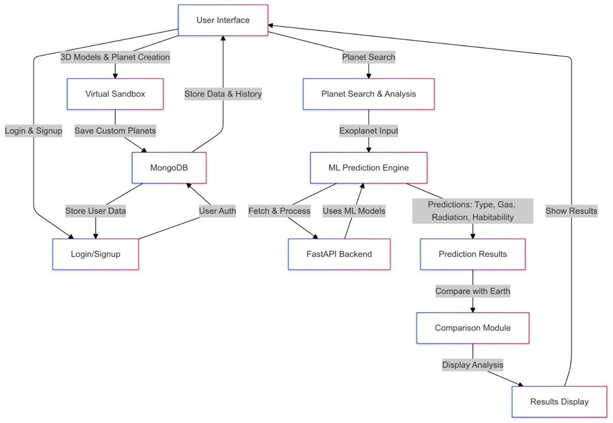

1. **User lands on homepage** and can explore our solar system or others using 3D simulation.
2. **User selects a planet** to see its detailed characteristics and predicted atmospheric data.
3. **Backend fetches planetary data** (mass, radius, temperature, orbit, etc.) from NASA Exoplanet Archive.
4. **ML model analyzes all characteristics** using a combination of ML models
5. **Results are visualized** using Gemini AI and AI analysis is provided.
6. **Sandbox mode** lets users create planets and simulate gravitational interactions in real-time.

## 💻 Installation

1. Clone the repository:

   ```bash
   git clone https://github.com/PratyayKoley/Exohabitat.git
   cd Exohabitat
   ```
2. Install Dependencies:

   #### Backend


   ```bash
   cd Backend
   python -m venv .venv
   .venv/Scripts/activate  # For Windows
   # Or use: source .venv/bin/activate  # For macOS/Linux

   pip install -r requirements.txt
   uvicorn main:app --reload
   ```

   ⚠️ Note: Make sure you are using Python 3.11 or lower. TensorFlow currently does not support Python 3.12 or above.

   #### Frontend

   ```bash
   cd Frontend
   npm install 
   npm run dev
   ```
3. Create .env files:

   #### Backend


   ```bash
   GEMINI_API_KEY=your_gemini_api_key
   NEWS_API=https://newsapi.org/v2/top-headlines?country=us&category=science&apiKey=your_news_api_key
   ```

   #### Frontend

   ```bash
   VITE_BACKEND_URL=your_backend_url
   ```

## 🖼️ Screenshots

### 🔹 Home & Landing Page

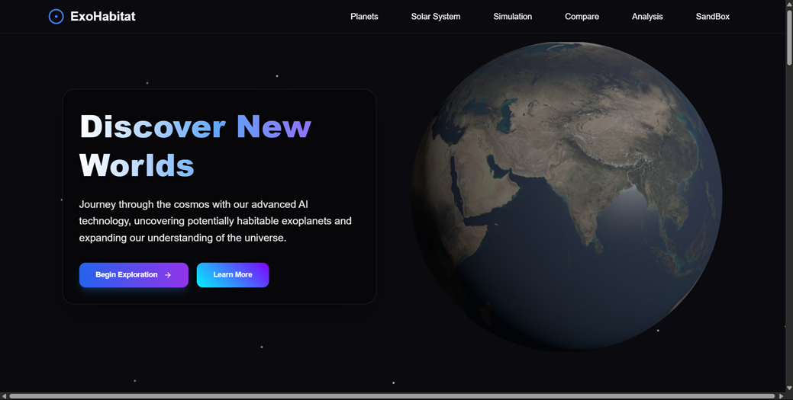
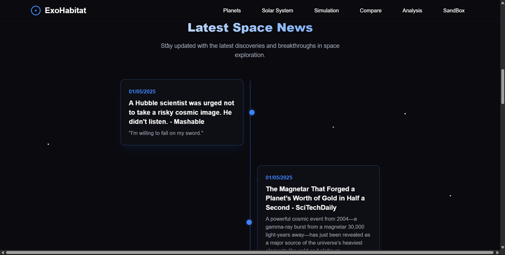

---

### 🔹 Planetary Characteristics and Earth Overview

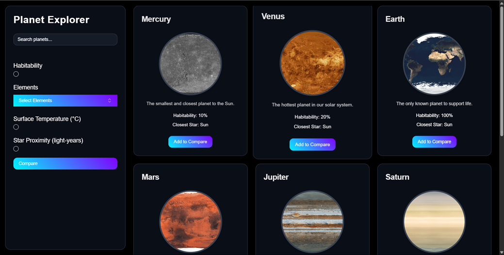
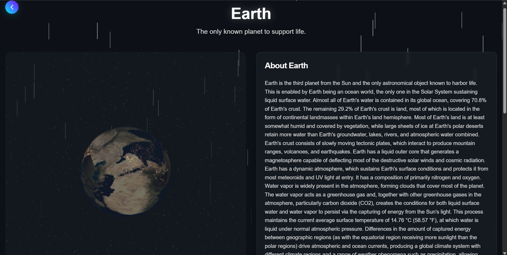

---

### 🔹 AI-Powered Analysis Dashboard

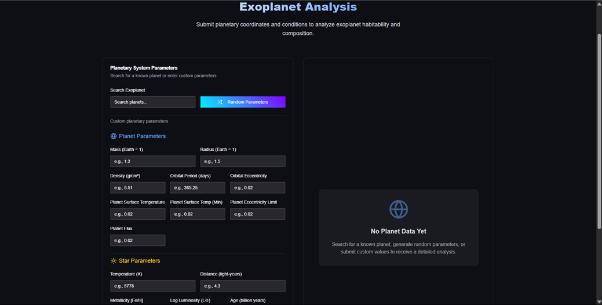
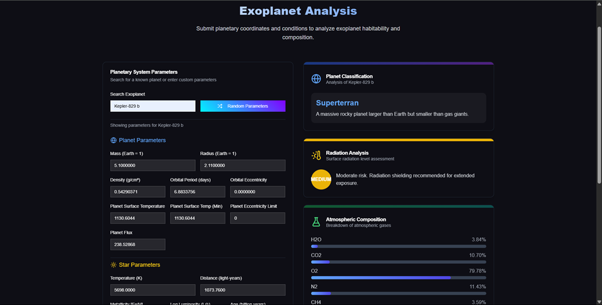
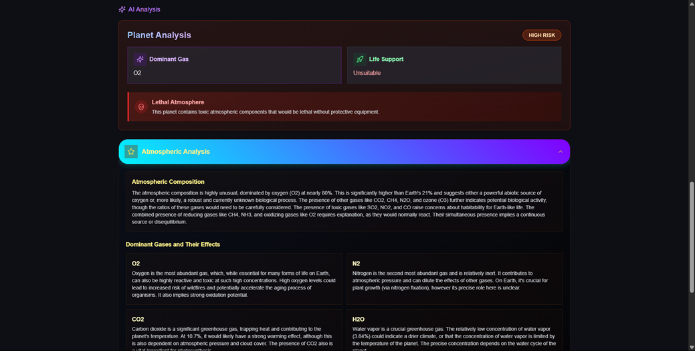

---

### 🔹 Habitability Analysis & Prediction

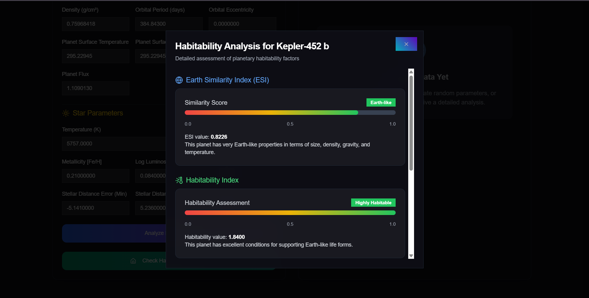
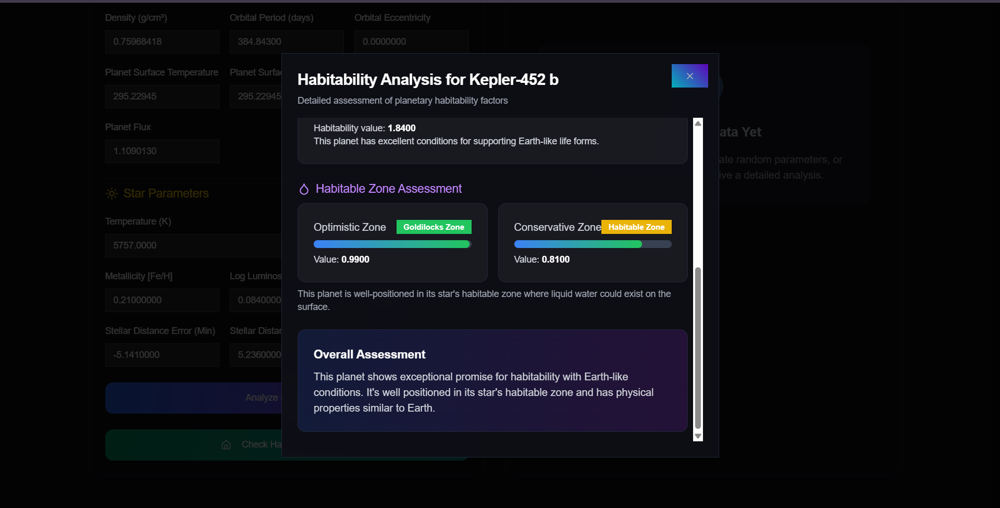

---

### 🔹 Clustering and Decision Tree Analysis

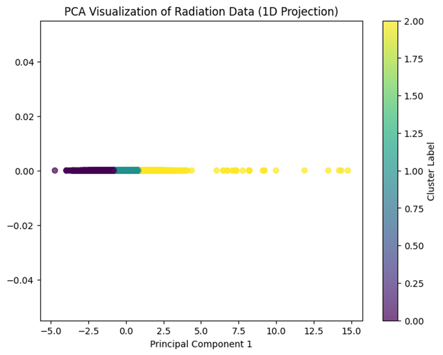


---

### 🔹 Gravity and Orbital Simulation

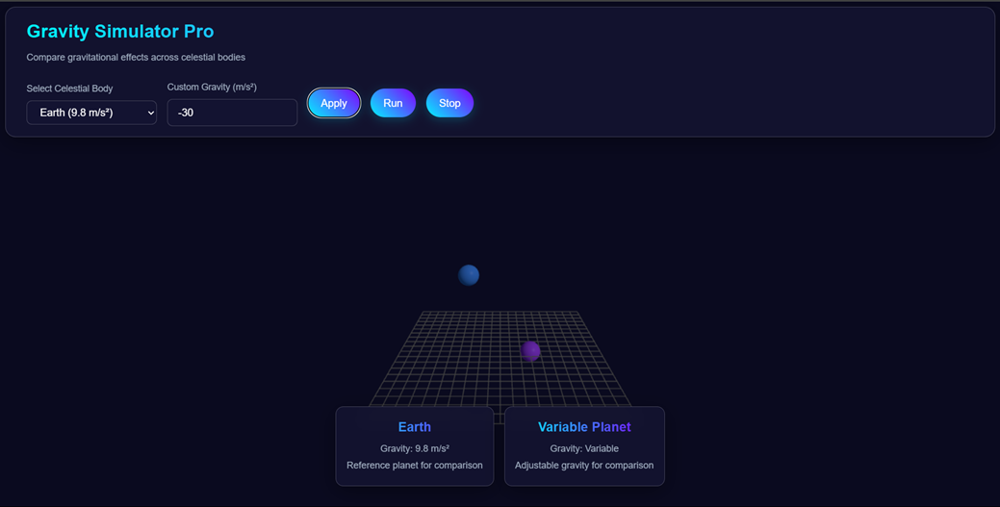

---

### 🔹 Custom Universe & Comparison

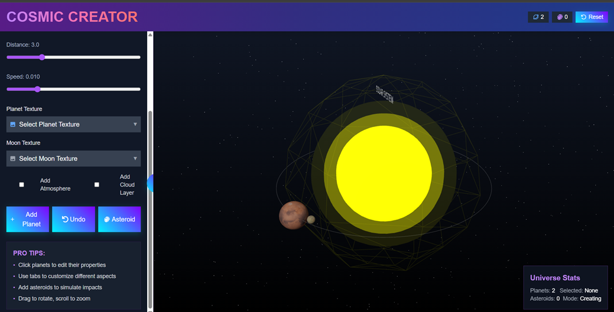
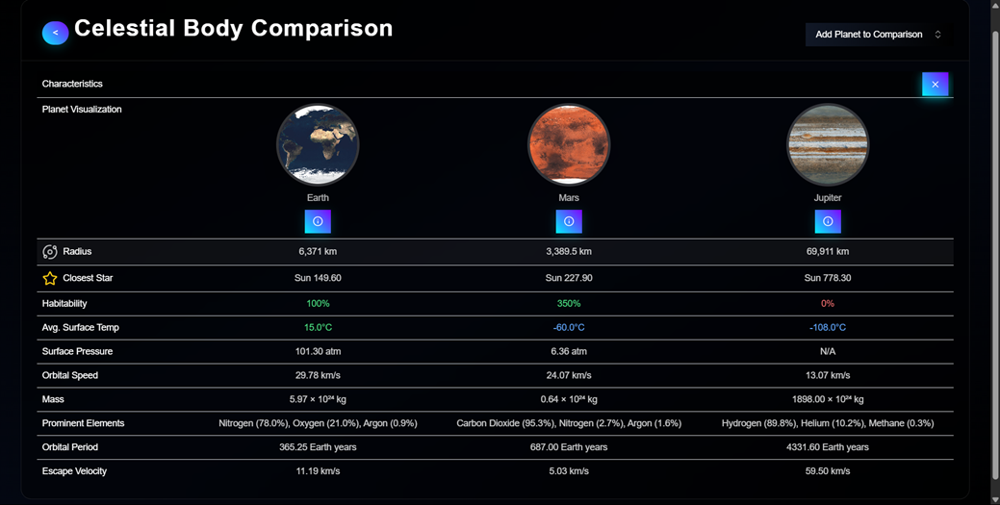

---

### 🔹 Solar System 3D

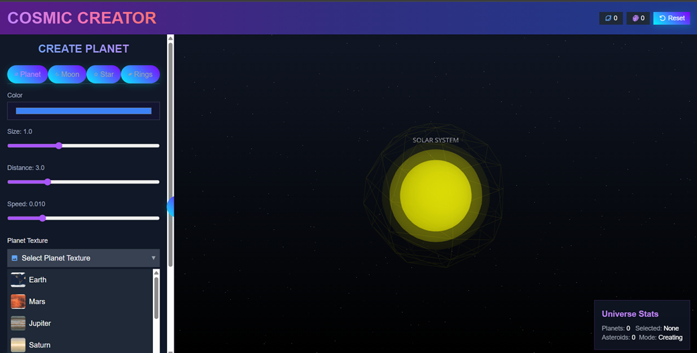

---

## 🔗 Datasets and References

### Datasets Used

- [NASA Exoplanet Archive](https://exoplanetarchive.ipac.caltech.edu/docs/data.html)
- [PHL HABITABLE WORLDS CATALOG](https://phl.upr.edu/hwc/data)
- [Github Repository](https://github.com/ACM-Research/exoplanet-atmosphere-analysis-with-ML)
  *We used the dataset made available through this repository, which in turn sourced data from a collaboration between the NASA Astrobiology II Team and Google Cloud. The dataset was accessed via a public Google Cloud bucket and includes:
  Atmospheric compositions of 12 key gases, H2O, CO2, O2, N2, CH4, N2O, CO, O3, SO2, NH3, C2H6, NO2.*

## 🤝 Contributing

Contributions, ideas, and suggestions are welcome! If you'd like to contribute:

- Fork this repo
- Create a new branch (git checkout -b feature-name)
- Commit your changes
- Open a Pull Request

## 📄 License

This project is licensed under the MIT License. See the LICENSE file for more information.
